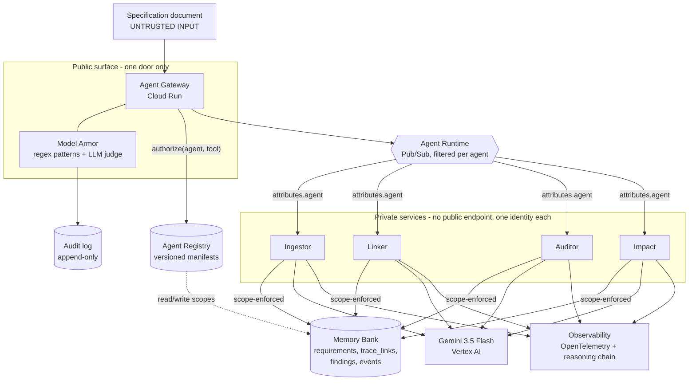

# Traceability Fleet

**A governed fleet of agents that keeps requirements traceability alive - and treats every specification document as an attack surface.**

Submission for the **All Things Agentic Hackathon** (Google) - category *Fortified Enterprise Fleet*.
Built with Gemini 3.5, Cloud Run, Firestore, Pub/Sub and Cloud Trace.

---

## The friction

In regulated engineering - automotive, aerospace, rail, medical - one artefact carries the whole programme: the **traceability matrix** linking every requirement to its design and its test.

On every programme it rots. Requirements get edited, tests get renamed, links go stale. Nobody notices, because keeping it alive is nobody's full-time job - until an audit, when it becomes everybody's problem.

*This is not a hypothetical use case. It is eight years of watching it happen from the inside, in DOORS and Polarion.*

## The twist

A specification document is **untrusted input**. Anyone in a supply chain can type text into a requirement.

So a fleet of agents that reads specifications is not only an automation problem - it is an attack surface. That is why this system has identity, policy enforcement, inline guardrails and an audit trail. Not as compliance theatre. **Because the documents themselves are the threat.**

The attack that matters here is not data theft. It is **verdict tampering**: making the system approve requirements that do not comply. No generic prompt-injection filter looks for that.

---

## Architecture



---

## The seven required components

| Requirement | Implementation |
|---|---|
| **Agent Registry** - publishing, versioning, discovery | `common/registry.py` - versioned manifests in Firestore, `GET /registry` for discovery |
| **Agent Runtime** - long-running async execution | Pub/Sub topic + per-agent push subscriptions filtered on `attributes.agent`, 600s ack deadline |
| **Memory Bank** - persistent cross-session context | `common/memory.py` - the traceability graph itself, an append-only event log, and `rehydrate()` |
| **Agent Identity** - zero-trust access control | Four service accounts, one per agent. `registry.authorize()` on every hop, deny by default |
| **Agent Gateway** - unified routing and policy | `services/gateway/main.py` - the only public service. Screens, authorises, dispatches |
| **Model Armor** - inline guardrails | `common/armor.py` - deterministic patterns **and** an independent LLM judge |
| **Observability** - OTel logs and reasoning traces | `common/telemetry.py` - spans to Cloud Trace plus a reasoning chain on the same trace id |

## The fleet

| Agent | Department | May write | Cannot |
|---|---|---|---|
| **Ingestor** | Systems Engineering | `requirements` | Read them back. It has hands, not eyes |
| **Linker** | Systems Engineering | `trace_links` | Touch requirements |
| **Auditor** | Quality Assurance | `findings` | **Modify what it audits** |
| **Impact** | Change Management | `impact_reports` | Alter the graph |

---

## Design decisions worth defending

**Deterministic checks before the model.** An orphan requirement is a set difference, not a judgement call. The Auditor computes orphans and unverifiable requirements in code, and only asks Gemini about contradictions and overlaps - the part that genuinely needs reading comprehension. Every finding records its `detector`, so a reviewer knows what to trust.

**Separation of duties, enforced by infrastructure.** The Auditor can read the graph and write findings, but cannot write requirements. If it were compromised, it could not approve itself. This is checked on every call, not once at startup.

**Two independent guardrail layers.** Deterministic patterns catch ten attack families; an LLM judge independently classifies intent. Either one blocks. A novel phrasing that slips past the regexes still meets the judge, and a judge outage still leaves a deterministic floor.

**One image, many roles.** All four agents run the same audited container. The role is injected at deploy time and never chosen at runtime, so a compromised worker cannot promote itself into another agent's scopes.

**Compact state instead of replayed history.** Weeks of asynchronous operation do not fit in a context window. `rehydrate()` returns a structured summary - and returns a narrower one to an agent with narrower scopes.

---

## Reproducing it

```bash
export PROJECT_ID="your-project-id"
gcloud config set project $PROJECT_ID

gcloud services enable aiplatform.googleapis.com run.googleapis.com \
  firestore.googleapis.com pubsub.googleapis.com cloudbuild.googleapis.com \
  artifactregistry.googleapis.com cloudtrace.googleapis.com

gcloud firestore databases create --location=eur3
gcloud pubsub topics create agent-tasks

GCP_PROJECT=$PROJECT_ID python3 -m common.registry   # publish agent manifests

gcloud run deploy tf-gateway --source . --region europe-west1 \
  --allow-unauthenticated --clear-base-image \
  --set-env-vars "GCP_PROJECT=$PROJECT_ID,GEMINI_MODEL=gemini-3.5-flash"

bash scripts/deploy_fleet.sh
```

Then:

```bash
GW=$(gcloud run services describe tf-gateway --region europe-west1 --format='value(status.url)')

curl -X POST $GW/submit -H 'Content-Type: application/json' -d '{"project":"P-DEMO","task":"extract_requirements","text":"The pump controller shall maintain outlet pressure between 4.0 and 4.5 bar. It shall shut down within 200 ms if pressure exceeds 6.0 bar. The operator interface shall be user friendly."}'

curl $GW/state/P-DEMO      # compact project state
curl $GW/runs/RUN_ID       # the reasoning chain
```

### Two things that will bite you

- **`gemini-3.5-flash` only answers on `location="global"`.** In `europe-west1` and `us-central1` only the 2.5 family responds, which does not meet the contest minimum. Measured, not assumed.
- **Grant IAM to the agent service accounts, then wait.** Propagation took about 3 minutes here. Never silence errors from `add-iam-policy-binding` - ours failed quietly and cost an hour of debugging.

---

## Honest limitations

- **Firestore IAM is not per-collection.** Each agent holds `roles/datastore.user`, so separation between collections is enforced by the Memory Bank in application code, not by Google IAM. The service account boundary is real; the collection boundary is ours.
- **"Weeks of asynchronous operation" is demonstrated by mechanism, not elapsed time.** The system was built inside the submission window.
- **The LLM judge costs a Gemini call per document.** At high volume the deterministic layer should gate it.

## Disclosure

Built during the submission period using AI coding assistants, which the contest rules explicitly permit. Every architectural decision, and every trade-off above, is one I can defend.
